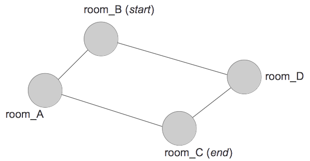

# Lem-in

The __*lem-in*__ project at [42](https://www.42.fr/) consists in writing a program that takes an undirected graph (an anthill composed of connected rooms) and computes the most efficient way to move N ants from source node to sink node.

It serves as an introduction to graph theory and maximum flow problems.

## Compiling
Run `make`. An executable named **_lem-in_** will be compiled.

## Instructions
### Input

The program receives a description of the anthill on the standard input with the following format:
```
number_of_ants
rooms
connections
```

*Rooms* and their *connections* are defined according to the following format:
- __*Rooms*__: `room_name  x_coord y_coord`
- __*Connections*__: `room_name_1-room_name_2`

__*Comments*__ can be added. They start with the character `#`.

__Special commands__ that characterize the following line start with `##`. For example, the `##start` command indicates the entrance room and the `##end` command the exit room.

Example:
```
#This is a comment
10
room_A 0 1
##start
room_B 1 0
##end
room_C 2 2
room_D 3 1
room_A-room_B
room_A-room_C
#This is another comment
room_B-room_D
room_C-room_D
```
This represents the following graph:



### Rules

- Unkown commands are ignored.
- A room name cannot start with the letter `L`
- If a wrongly formated line is found, the parsing stops and the solver is launched with the available data.
- If there is not enough data to find a solution, the program should print `ERROR`.
- Each room can contain **only one ant**

### Output

The output expected on the standard output is the following:
```
number_of_ants
rooms
connections

Lx-room_A Ly-room_B Lz-room_C
...
...
```
Where x, y and z are ants numbers (from 1 to *number_of_ants*).

Example:
```
$ ./lem-in < input.graph
#This is a comment
5
room_A 0 1
##start
room_B 1 0
##end
room_C 2 2
room_D 3 1
room_A-room_B
room_A-room_C
#This is another comment
room_B-room_D
room_C-room_D

L1-room_D L2-room_A
L1-room_C L2-room_C L3-room_D L4-room_A
L3-room_C L4-room_C L5-room_D
L5-room_C
```

## Algorithm
We re-formulated the problem into a __minimum cost maximum flow__ problem on an undirected graph. Our objective is to find the maximum flow, and among all maximal flows we want to find the one with the least cost.

Our algorithm is __based on the Edmond-Karp algorithm__ (implementation of the Ford-Fulkerson method for computing the maximum flow that uses BFS for finding augmenting path).

We consider that all edges have the same cost per unit of flow (we fix it as 1). When the algorithm searches an augmenting path, it computes the total cost of the path and keeps searching other paths that might have a lower cost until no more augmenting paths are available.

Each time an optimal augmenting path is found, we compute the optimal number of steps required to move all the ants from source node to sink node (formula based on the number of ants, the number of paths and the length of each path). If the number of steps is better with the new set of paths, we keep it, otherwise we keep the previous one.

## Additional features

Here are some non-mandatory features we included to the project:
- A **detailed error handling system** (`-e` option):
```
$ ./lem-in -e < map_negative_number_of_ants
ERROR: (-251) [ants] invalid number of ants
$ ./lem-in -e < map_room_name_start_with_L
ERROR: (-245) [parser] line starts with 'L'
$ ./lem-in -e < map_room_name_with_dash
ERROR: (-237) [room] invalid room name
$ ./lem-in -e < map_duplicated_room_name
ERROR: (-236) [room] name already exists
$ ./lem-in -e < map_no_start
ERROR: (-230) [env] no start defined
```
- A **debug mode** (`-d` option): prints the number of steps, the paths found with their length
- Various **tools** to tests
	- the *parsing* of the input with maps wrongly formated
	- the *performance* of the program (number of steps found vs expected, time complexity)

## Key learnings

- Elements of **graph theory**: maximum flow problems, graph search algorithms
- **Red-black trees**: we use them during the parsing to reduce the time complexity when checking for errors such as duplicated rooms
- **Binary search** algorithm

## References

- https://cp-algorithms.com/
- Max flow problem and augmenting path algorithm: http://www.ifp.illinois.edu/~angelia/ge330fall09_maxflowl20.pdf
